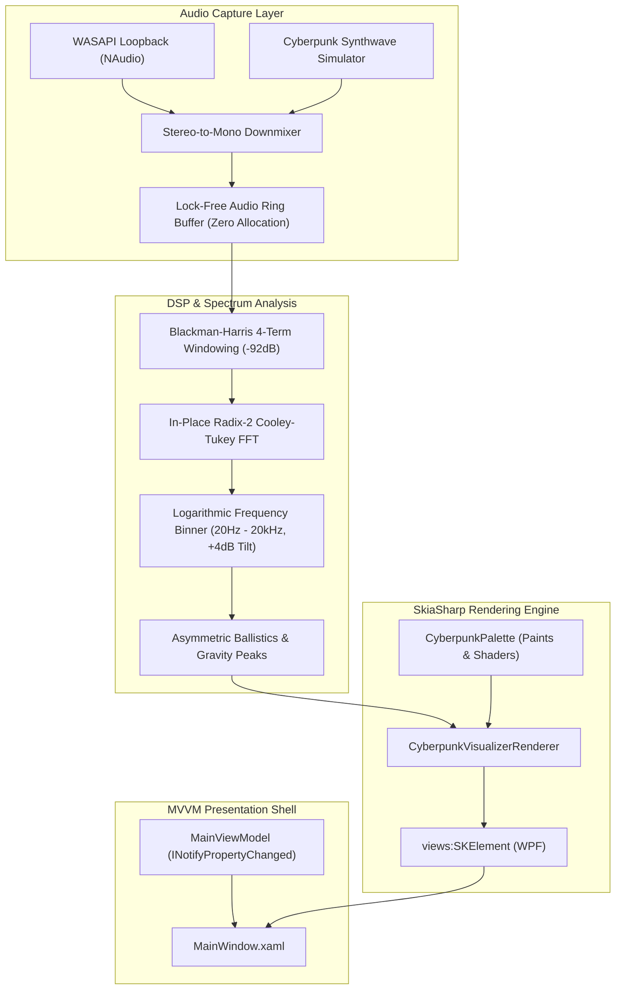

# ⚡ Cyberpunk Spectrum Engine

[](https://dotnet.microsoft.com/)
[](https://learn.microsoft.com/en-us/dotnet/csharp/)
[](https://learn.microsoft.com/en-us/dotnet/desktop/wpf/)
[](https://github.com/mono/SkiaSharp)
[](https://github.com/naudio/NAudio)
[](#-automated-tests)
[](LICENSE)

A high-performance, real-time desktop music visualizer built with modern **C# .NET 10**, featuring **NAudio WASAPI Loopback Capture**, a precision **4-term Blackman-Harris FFT DSP engine** with psychoacoustic logarithmic scaling and zero-allocation ballistics, and a hardware-accelerated **SkiaSharp** neon rendering engine delivering an immersive cyberpunk aesthetic (**Electric Cyan** `#00F0FF` and **Glowing Violet** `#8A2BE2`).

---

## ✨ Features

- 🎧 **Real-World System Audio Loopback**: Captures live Windows desktop audio using `NAudio.Wave.WasapiLoopbackCapture`. Automatically detects sample rates, formats (IEEE Float 32-bit & PCM), downmixing stereo/surround to mono with zero runtime heap allocation.
- 🎹 **Procedural Cyberpunk Synthwave Generator**: Built-in 48 kHz multi-frequency synthesizer (sub-bass kick, saw bassline, band-pass filtered hi-hat sizzle, and ambient chords). Test the visualizer anytime without playing external audio!
- 📐 **Blackman-Harris 4-Term Windowing**: Eliminates spectral leakage with $>92\text{ dB}$ side-lobe suppression for razor-sharp frequency resolution.
- 📊 **Logarithmic Musical Frequency Scaling**: Maps 20 Hz – 20,000 Hz human hearing across 32, 64, 96, or 128 discrete musical bands with $+4\text{ dB/octave}$ psychoacoustic treble tilt.
- 🪂 **Asymmetric Ballistics & Gravitational Peaks**: Punchy instant attack ($0.85$ lerp) on transient kicks, buttery exponential decay ($0.20$ lerp), and floating peak beads that hang for 6 frames before dropping under simulated gravity.
- 🎨 **Hardware-Accelerated SkiaSharp Cyberpunk Rendering**:
  - **Multi-pass Bloom Glow**: Blurred outer glow strokes (`SKMaskFilter.CreateBlur`) paired with bright core strokes.
  - **Mirrored Floor Reflection**: Inverted reflection with alpha fade and horizontal CRT scanlines.
- 🔀 **3 Switchable Visual Modes**:
  1. **Spectrum Bars**: Classic dual-tone vertical bars with gravity peak caps and floor reflection.
  2. **Radial Iris**: Circular radiating spectrum with a central energy orb that pulses with sub-bass energy.
  3. **Laser Ribbon**: Oscilloscope laser curve with chromatic aberration (Cyan & Magenta sub-pixel separation) and phosphor persistence trails.
- 🎛️ **Floating Cyberpunk HUD Dock**: Switch modes, toggle live audio vs synth demo, adjust sensitivity (0.2x – 3.0x), switch audio output devices, and monitor FPS in real time.

---

## 🏛️ Architecture & DSP Pipeline



---

## 🚀 Quick Start

### Prerequisites
- Windows 10 / 11 (64-bit)
- [.NET 10 SDK](https://dotnet.microsoft.com/download/dotnet/10.0) (v10.0.100 or newer)

### Run Application
```powershell
# Clone the repository
git clone https://github.com/<your-username>/SimpleMusicVisualizer.git
cd SimpleMusicVisualizer

# Run the visualizer
dotnet run --project SimpleMusicVisualizer.csproj
```

### Controls & Navigation
- **Drag Window**: Click and drag anywhere on the top title header.
- **Toggle Audio Stream**: Click `LIVE AUDIO / SYNTH DEMO` on the bottom HUD dock to switch between system audio and the built-in procedural synthesizer.
- **Switch Modes**: Select `SPECTRUM BARS`, `RADIAL IRIS`, or `LASER RIBBON`.
- **Adjust Sensitivity**: Use the `SENS` slider to increase or decrease bar heights.

---

## 🧪 Automated Tests

The solution includes an automated xUnit test suite validating DSP precision, math symmetry, and zero-allocation runtime performance:

```powershell
dotnet test SimpleMusicVisualizer.slnx
```

**Results:**
- **28 Tests Passed, 0 Failed, 0 Skipped**
- Verifies `GC.GetAllocatedBytesForCurrentThread() == 0` during frame processing in `ZeroAllocationTests`.
- Verifies mathematical symmetry $w(n) = w(N-1-n)$ and boundary near-zero values in `BlackmanHarrisWindowTests`.
- Verifies pure sine wave FFT peak placement accuracy in `FastFourierTransformTests`.
- Verifies full frequency coverage and monotonic octave boundaries in `LogarithmicSpectrumBinnerTests`.
- Verifies ballistics attack response and gravitational peak drop acceleration in `SpectrumBallisticsTests`.
- Verifies circular buffer concurrency and synthetic audio bounds in `AudioTests`.

---

## 📁 Project Structure

```
SimpleMusicVisualizer
├── Core
│   ├── Audio
│   │   ├── IAudioCaptureService.cs          # Audio capture interface
│   │   ├── AudioRingBuffer.cs               # High-performance lock-free circular buffer
│   │   ├── CyberpunkAudioSimulator.cs       # Procedural 48kHz multi-frequency synth
│   │   └── WasapiCaptureService.cs          # Real-world WASAPI loopback capture
│   └── Dsp
│       ├── BlackmanHarrisWindow.cs          # 4-term minimum Blackman-Harris window
│       ├── FastFourierTransform.cs          # In-place Radix-2 Cooley-Tukey FFT
│       ├── LogarithmicSpectrumBinner.cs     # Logarithmic frequency mapping (+4dB tilt)
│       ├── SpectrumBallistics.cs            # Attack/decay smoothing & gravity peaks
│       └── SpectrumAnalyzer.cs              # Zero-allocation DSP frame coordinator
├── UI
│   ├── CyberpunkPalette.cs                  # Color definitions, SKPaints & gradient shaders
│   ├── VisualizerMode.cs                    # SpectrumBars, RadialIris, LaserRibbon enums
│   ├── CyberpunkVisualizerRenderer.cs       # SkiaSharp multi-pass neon drawing engine
│   ├── RelayCommand.cs                      # MVVM ICommand implementation
│   ├── MainViewModel.cs                     # Reactive state & control bindings
│   ├── MainWindow.xaml                      # Cyberpunk borderless shell & HUD dock
│   └── MainWindow.xaml.cs                   # Render loop & surface invalidation
├── tests
│   └── SimpleMusicVisualizer.Tests          # Comprehensive xUnit test suite (28 tests)
└── .gitignore                               # Standard .NET / Visual Studio ignore rules
```

---

## 📜 License

This project is licensed under the [MIT License](LICENSE).

